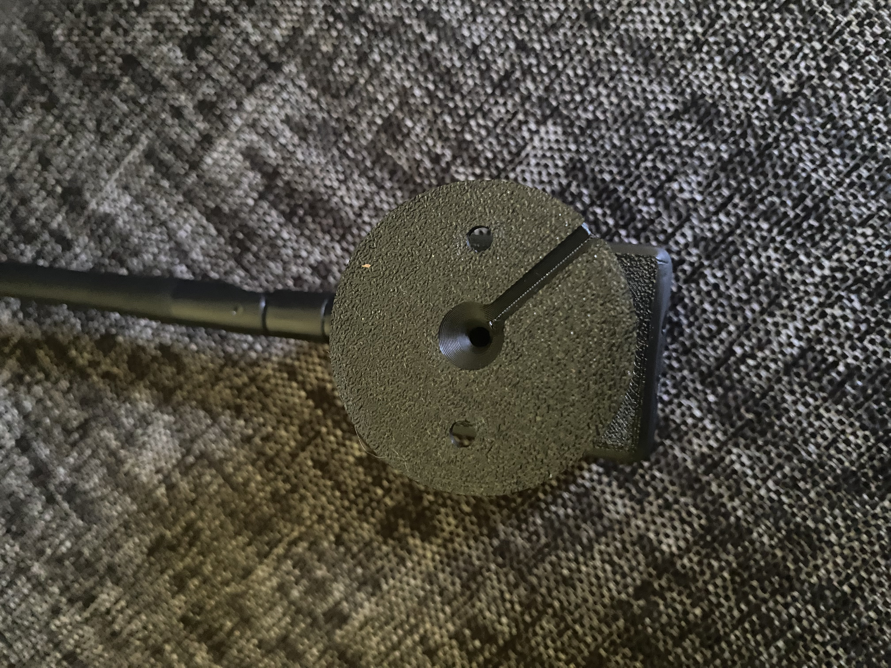
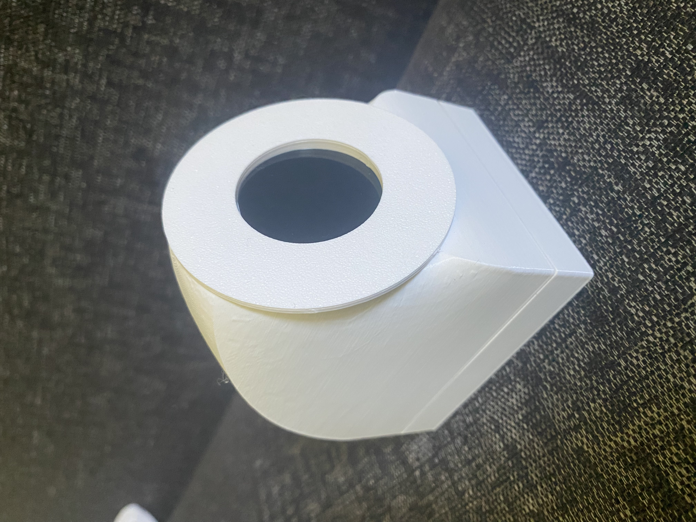
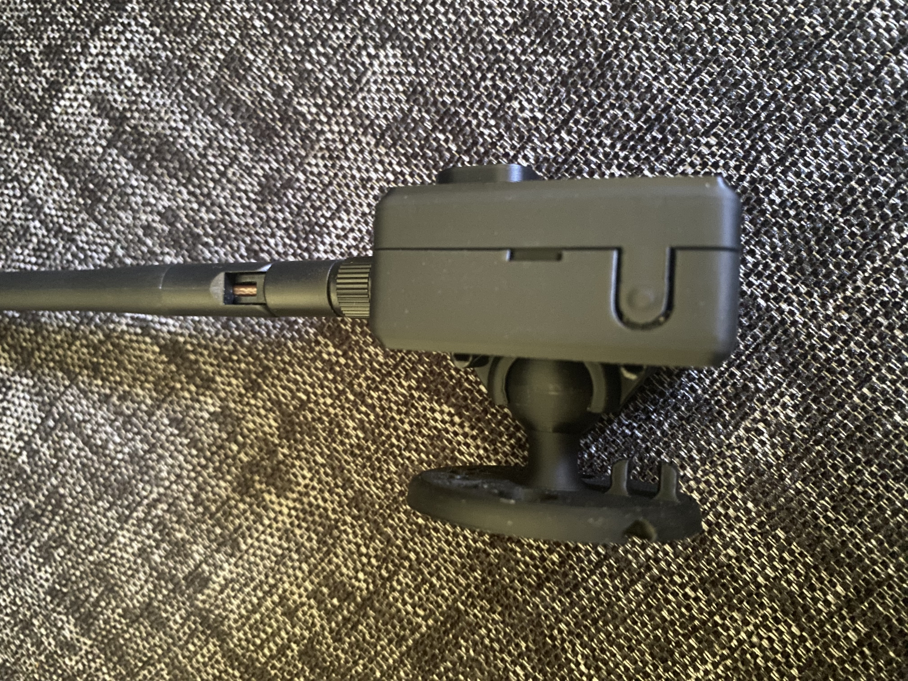
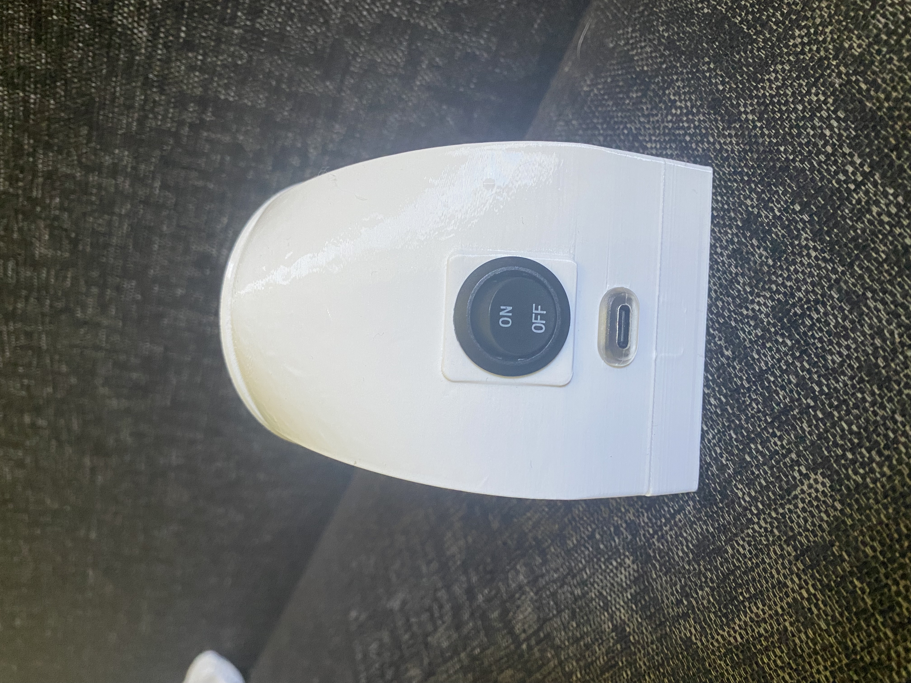

# Smart Door Camera — Live ESP32-CAM Feed on a Round ESP32-S3 Display

A compact, fully DIY surveillance set for your home WiFi: an **ESP32-CAM** door camera streams live
video to a second device — an **ESP32-S3** with a round 1.28" display — that sits on your desk and
shows the feed in real time. Everything is configured from your **phone** through a built-in web app
(captive portal); there are **no credentials in the code**.

<p align="center">
  
  &nbsp;
  
</p>

```
[ESP32-CAM] --MJPEG/HTTP--> Home WiFi --HTTP GET /stream--> [ESP32-S3] --SPI--> [GC9A01]
 240x240 JPEG               (router)                        TJpg_Decoder + TFT_eSPI
 doorcam.local:81/stream
```

- **Door camera** (`doorcam/`): AI-Thinker **ESP32-CAM** serves an MJPEG stream over HTTP.
- **Office display** (`officedisplay/`): **ESP32-S3** with a round **GC9A01** TFT (240×240, SPI) fetches the stream, decodes the JPEG frames and shows them live.

---

## Features

- **Phone-based setup, no hardcoded credentials.** On first boot each device opens its own WiFi
  hotspot with a captive-portal web app. You enter your home WiFi there; it's stored in flash and
  both devices reconnect automatically after a restart.
- **Permanent, optionally password-protected hotspots.** Both devices run in **AP+STA** mode: they
  are on your home WiFi *and* keep a hotspot visible at all times (`http://192.168.4.1`), so you can
  reconfigure them anytime. Each hotspot can be locked with a WPA2 password (Security tab).
- **Live video on a round display.** The camera sends a 240×240 MJPEG stream; the ESP32-S3 decodes
  the JPEG frames (TJpg_Decoder) and pushes them 1:1 onto the GC9A01 (TFT_eSPI) — no scaling.
- **Remote LED control.** Toggle the camera's white front LED from the display's **Light** tab.
- **Live image tuning.** Adjust brightness, contrast, saturation, special effect, white balance and
  JPEG quality from the display's **Image** tab. Changes apply **system-wide** on the camera sensor
  and are stored persistently.
- **Robust networking.** mDNS (`doorcam.local`), automatic reconnect, and a captive-portal-safe UI
  (plain forms/links, validated server-side — works even inside iOS's captive-portal browser).
- **One-command flashing.** Helper scripts (`flash-display.sh`, `flash-camera.sh`) build and flash a
  module with automatic serial-port detection — handy when building more units.

---

## Components (bill of materials)

The links below are the exact parts used for this build (these are affiliate links):

| Component | Used for | Link |
|-----------|----------|------|
| **ESP32-CAM** (AI-Thinker, OV2640) | Door camera | https://s.click.aliexpress.com/e/_c3opiTUp |
| **ESP32-S3 dual Type-C development board** | Office display controller | https://s.click.aliexpress.com/e/_c4a0icBb |
| **1.28″ round TFT LCD (GC9A01, 240×240, SPI)** | Display screen | https://s.click.aliexpress.com/e/_c3PFGw7j |
| **USB Type-C connector** | Power/USB on the display housing | https://s.click.aliexpress.com/e/_c37zWXtF |
| **Mini round toggle switch** | On/off switch on the display housing | https://s.click.aliexpress.com/e/_c3Ep0wFj |

**Also needed (not linked):**
- A **USB-to-TTL adapter** (3.3 V capable, e.g. CP2102/CH340) to flash the ESP32-CAM — *or* an
  **ESP32-CAM-MB** programmer board. The ESP32-CAM has no USB port of its own.
- A few **jumper wires** (display ↔ ESP32-S3, and camera ↔ USB-TTL).
- A stable **5 V / ≥ 2 A** power supply for permanent operation.
- Optional: **3D-printed housings** for both modules (as shown in the photos).

---

## Hardware & wiring

### GC9A01 (240×240, SPI) ↔ ESP32-S3
The display uses **SPI** (despite the SCL/SDA labels — it is not I²C). No MISO, and no separate backlight pin (backlight is always on).

| Display pin | Function          | ESP32-S3 GPIO |
|-------------|-------------------|---------------|
| VCC         | 3.3 V             | 3V3           |
| GND         | Ground            | GND           |
| SCL         | SPI clock (SCLK)  | GPIO12        |
| SDA         | SPI MOSI          | GPIO11        |
| DC          | Data/Command      | GPIO13        |
| CS          | Chip Select       | GPIO10        |
| RST         | Reset             | GPIO14        |

> Other GPIOs are possible — just adjust the `-DTFT_*` flags in [officedisplay/platformio.ini](officedisplay/platformio.ini). Avoid on the S3: GPIO19/20 (USB), 26–32 (flash), 33–37 (octal PSRAM), strapping pins 0/3/45/46.

### ESP32-CAM ↔ USB-to-TTL adapter (for flashing)
The ESP32-CAM has **no USB port**. Set the adapter to **3.3 V**:

| USB-TTL | ESP32-CAM |
|---------|-----------|
| 5V      | 5V        |
| GND     | GND       |
| TX      | U0R (RX)  |
| RX      | U0T (TX)  |

**Flash mode:** bridge GPIO0 → GND, then press RESET (or briefly cut power). After the upload, remove the bridge and restart. (With an **ESP32-CAM-MB** board the RESET button is usually enough.)

For permanent operation: a stable **5 V / ≥ 2 A** supply (otherwise brownout resets).

---

## Set up the toolchain (once, in the Mac terminal)

```bash
brew install platformio        # alternative: python3 -m pip install --user platformio
pio --version
```

On the first `pio run`, PlatformIO downloads the compiler, the ESP32 platform and the libraries automatically.

---

## Flashing

### Quick way: flash scripts

For additional/new modules there are two ready-made scripts in the project root. Just **connect the respective module via USB** and run:

```bash
./flash-display.sh     # build + flash the ESP32-S3 (office display)
./flash-camera.sh      # build + flash the ESP32-CAM (door camera)
```

- **The port is detected automatically** — this also works with new modules (different serial number). Best to connect **only one module at a time**.
- If several serial devices are attached, the script prefers the matching one (display = FTDI/native USB, camera = CH340/CP210x) or lists them — then pass the port as an argument: `./flash-display.sh /dev/cu.usbserial-XXXX`.
- After a successful flash the script asks whether to open the serial monitor.
- If the camera upload does not start (simple adapter without auto-reset): bridge GPIO0→GND, press RESET, run the script again.

The manual steps (if you prefer to do it without the script):

### 1) ESP32-S3 display (via FTDI USB bridge)

The original board uses an **FTDI FT232R** as a USB-UART bridge — so the port is named
`/dev/cu.usbserial-*` (not `usbmodem`). In `platformio.ini` it is fixed to
`/dev/cu.usbserial-A5069RR4` (adjust for a different board).

```bash
cd officedisplay

# Connect the S3 via USB-C, check the port:
ls /dev/cu.usbserial*   # -> /dev/cu.usbserial-A5069RR4

pio run                 # compile
pio run -t upload       # flash
pio device monitor      # serial monitor (115200 baud)
```

If the upload does not start by itself: hold **BOOT/IO0**, briefly press **RESET**, release **BOOT** (download mode), then run `pio run -t upload` again.

### 2) ESP32-CAM door camera (via USB-TTL)

```bash
cd doorcam

# Connect USB-TTL (3.3 V!), bridge GPIO0->GND, press RESET
ls /dev/cu.usbserial*   # or /dev/cu.SLAB_USBtoUART / wchusbserial

pio run                 # compile
pio run -t upload --upload-port /dev/cu.usbserial-XXXX

# After success: remove the GPIO0 bridge, press RESET
pio device monitor --port /dev/cu.usbserial-XXXX
```

---

## First-time setup

1. **Power on the camera** → iPhone WiFi: **"DoorCam-Setup"** → the portal opens → tab **WiFi** (home SSID + password) → save. The serial monitor shows the IP and `doorcam.local`. The hotspot stays **permanently visible** (see below).
2. **Test the stream** (Mac, same WiFi): browser → `http://doorcam.local:81/stream` (or `http://<ip>:81/stream`). Config portal: `http://doorcam.local/`.
3. **Power on the display** → iPhone WiFi: **"OfficeDisplay-Setup"** → the portal opens → tab **WiFi** (home SSID + password), tab **Camera** (check the URL, default `http://doorcam.local:81/stream`) → save each. The display shows status, then the live feed. The hotspot stays **permanently visible** (see below).
4. **DHCP reservation** for the camera in your router (recommended) — keeps the address stable in case mDNS hiccups.

## Hotspot security (display)

The ESP32-S3 runs in **AP+STA mode**: it is connected to the home WiFi (live feed) **and** at the same time provides a **permanently visible hotspot "OfficeDisplay-Setup"** through which you can reach the configuration anytime from your phone (`http://192.168.4.1`). The portal has five tabs:

| Tab | Function |
|-----|----------|
| **WiFi** | Home SSID + password (button "Scan networks" for the scan list) |
| **Camera** | Camera stream URL |
| **Light** | Turn the camera's front LED on/off |
| **Image** | Camera image settings (brightness, color, …) |
| **Security** | Set/change the hotspot password (password + repeat) |

**Protect the hotspot with a password:** tab **Security** → enter the password twice → save.
- Rule: **empty = open hotspot**, otherwise **at least 8 characters** (WPA2).
- After saving the **hotspot restarts** — reconnect afterwards with the **new password**. Existing connections are dropped.
- **Remove the password protection:** Security tab → leave both fields empty → save (the hotspot becomes open again).
- The WiFi/camera/hotspot password is stored permanently in flash (Preferences) and survives a restart.

### Resetting settings
- **Display (ESP32-S3):** WiFi, camera and hotspot password can be changed anytime in the portal. For a full reset, re-flash the firmware (this does not automatically clear the Preferences area — if needed, add a one-time `prefs.clear()` in `setup()` and flash).
- **Camera (ESP32-CAM):** WiFi and hotspot password can be changed anytime in the camera portal (see below). Full reset = re-flash the firmware.

> ⚠️ If you forget the hotspot password, you can no longer reach the portal from your phone. You can still reach the configuration via the device's **STA IP** on the home WiFi (`http://<ip>/`) or re-flash the firmware.

## Hotspot security (camera)

The **ESP32-CAM** also runs in **AP+STA mode**: connected to the home WiFi (serves the stream) **and** providing a **permanently visible hotspot "DoorCam-Setup"** (`http://192.168.4.1`) through which you configure the camera anytime from your phone. The portal has three tabs:

| Tab | Function |
|-----|----------|
| **Preview** | Live image of the camera (handy for aiming) |
| **WiFi** | Change the home WiFi (SSID + password, with scan) |
| **Security** | Set/change the hotspot password (password + repeat) |

**Protect the hotspot with a password:** tab **Security** → enter the password twice → save.
- Rule: **empty = open hotspot**, otherwise **at least 8 characters** (WPA2).
- After saving the **hotspot restarts** — reconnect afterwards with the **new password**.
- **Remove protection:** leave both fields empty → save.
- WiFi and hotspot password are stored permanently in flash (Preferences).

> Note: the camera's hotspot password affects **only** its hotspot, **not** the live feed to the display — that runs over the home WiFi and keeps working independently. If captive-portal buttons on the iPhone don't respond: open the page in **Safari** at `http://192.168.4.1`.

## Light control (camera LED)

The ESP32-CAM has a **white front LED (flash LED, GPIO4)** that can be controlled remotely from the display portal:

- Open the portal → tab **Light** → **Turn light on** / **Turn light off**.
- The status (ON/OFF) is shown in the tab.

**How it works:** the camera firmware provides an endpoint: `GET http://doorcam.local/led?on=1` (on) or `?on=0` (off) on **port 80**, response `{"on":0|1}`. The ESP32-S3 calls this endpoint when you tap in the Light tab (`/light?on=…`). Both firmwares must be up to date for this (re-flash camera **and** display).

> ⚠️ The front LED is **very bright** — don't look into it directly from close up. The LED state is not stored permanently; after a camera restart the LED is off.

## Image settings (color/brightness)

Via the display portal → tab **Image** you can adjust the camera's image parameters (OV2640 sensor). With **Save image** they take effect **system-wide** (stream, display and browser show the adjusted image) and are stored **permanently in the camera** — they persist across a restart.

| Setting | Values | Effect |
|---------|--------|--------|
| **Brightness** | −2 … +2 | brighter/darker |
| **Contrast** | −2 … +2 | contrast |
| **Saturation** | −2 … +2 | color intensity |
| **Special effect** | None, Negative, Grayscale, Reddish/Greenish/Bluish, Sepia | color filter |
| **White balance** | Automatic / Off | auto color temperature |
| **JPEG quality** | High (10) … Very low (45) | image quality vs. bitrate/frame rate |

**How it works:** when saving, the ESP32-S3 sends the values to the camera (`GET http://doorcam.local/imgset?br=&co=&sa=&fx=&awb=&q=` on **port 80**, response = current state as JSON). The camera applies them to the sensor immediately, stores them in its Preferences and restores them on boot. The form in the Image tab shows the last saved state.

---

## Notes / troubleshooting

- **mDNS** (`doorcam.local`) is resolved on the display via `MDNS.queryHost()`. If it hiccups, enter the fixed IP in the display portal (`http://192.168.x.y:81/stream`) and set a router reservation.
- **PSRAM**: the camera uses it (`fb_count=2`). The display does not need PSRAM (the 32 KB JPEG buffer fits in internal RAM; the code falls back from `ps_malloc` to `malloc`). The S3 `platformio.ini` is set to the boot-safe `qio_qspi` (works regardless of the actual PSRAM type).
- **Frame rate** ~10–15 fps (JPEG decoding is the bottleneck, not SPI). 240×240 is visually ideal for the round display.
- **Camera brownout**: use a stronger power supply.
- **Wrong display colors/mirroring**: on the display adjust `TJpgDec.setSwapBytes(...)` or `tft.setRotation(...)`; on the camera `s->set_vflip()/set_hmirror()` in [doorcam/src/main.cpp](doorcam/src/main.cpp).
- **ESP32-S3 + TFT_eSPI crash** (`Guru Meditation / StoreProhibited` in `begin_tft_write` right at `tft.init()`): on the S3, TFT_eSPI needs a dedicated SPI instance. The fix is `-DUSE_HSPI_PORT=1` in [officedisplay/platformio.ini](officedisplay/platformio.ini) (already set).
- **Portal buttons don't respond (iPhone):** iOS's automatic captive-portal mini-browser blocks some actions. Open the page in **Safari** at **`http://192.168.4.1`** instead (or via the display's STA IP). The forms are validated server-side (no JavaScript required).

---

## Build photos

| Camera module | Display module |
|---------------|----------------|
|  |  |
|  |  |

Both modules are housed in custom 3D-printed enclosures. The display housing has an on/off toggle switch and a USB-C port; the camera housing exposes the external WiFi antenna and sits on a small mount.

---

## License

Released under the [MIT License](LICENSE) © 2026 Tim-M-83.
